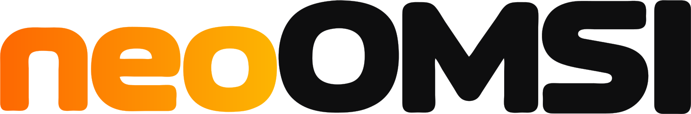

<p align="center">
  <picture>
    <source media="(prefers-color-scheme: dark)" srcset="assets/logos/wordmark-gradient-dark.svg">
    
  </picture>
</p>

<p align="center">
  <a href="https://github.com/neoOMSI/launcher/actions/workflows/test.yml"></a>
  <a href="https://github.com/neoOMSI/launcher/actions/workflows/build.yml"></a>
  <a href="https://neoomsi.com/"></a>
  <a href="https://github.com/neoOMSI/neoOMSI/releases/latest"></a>
  <a href="https://discord.gg/Gk7EngX6JK"></a>
  <a href="LICENSE"></a>
</p>

<p align="center">
  The desktop launcher of <a href="https://github.com/neoOMSI/neoOMSI"><strong>neoOMSI</strong></a>: plan a duty, pick a bus, manage mods and settings, and follow your running games.
</p>

> [!WARNING]
> **The launcher is in early development**, like neoOMSI itself. Pages and settings may change without notice.

> [!IMPORTANT]
> **The launcher ships with neoOMSI.** Download a [neoOMSI release](https://github.com/neoOMSI/neoOMSI/releases) and start neoOMSI: this launcher opens. There are no separate launcher downloads, and it does nothing without the game beside it.

## About the launcher

The launcher is an Electron and React app. It contains no simulation code: it starts the game as `neoomsi --control-protocol` and talks to it over standard input and output. The engine answers the launcher's requests (maps, buses, timetables, settings, mod installs, starting games) and pushes what changes: the running games and their loading progress, install progress, new content, and new passenger packs.

- **Engine-owned data:** Everything the launcher shows comes from the engine, so the launcher and the game's built-in launcher always agree.
- **Protocol:** Length-prefixed protobuf frames, specified in [LAUNCHER_PROTOCOL.md](https://github.com/neoOMSI/neoOMSI/blob/main/docs/LAUNCHER_PROTOCOL.md) in the neoOMSI repository. Its schema, `proto/launcher.proto`, is neoOMSI's; the TypeScript in `src/types/launcher_pb.ts` is generated from it. Launcher and engine check each other's protocol version at the handshake.
- **Shipping:** neoOMSI's release CI builds the launcher commit pinned in neoOMSI's [`scripts/launcher-ref`](https://github.com/neoOMSI/neoOMSI/blob/main/scripts/launcher-ref) into every release (`launcher/` beside the game; inside `neoOMSI.app` on macOS). A launcher change reaches players once that pin is moved to it.

## Documentation

| Guide                                                                                       | Description                                          |
| ------------------------------------------------------------------------------------------- | ---------------------------------------------------- |
| [Contributing](CONTRIBUTING.md)                                                             | Guidelines for contributors and PR expectations      |
| [Launcher protocol](https://github.com/neoOMSI/neoOMSI/blob/main/docs/LAUNCHER_PROTOCOL.md) | The engine's commands and events                     |
| [Building neoOMSI](https://github.com/neoOMSI/neoOMSI/blob/main/docs/BUILDING.md)           | Building the game, and packing this launcher into it |
| [Releasing & versioning](https://github.com/neoOMSI/neoOMSI/blob/main/docs/RELEASING.md)    | Release cadence and nightly builds                   |

## Quickstart

Install [Node.js](https://nodejs.org/) 24 and [pnpm](https://pnpm.io/), then:

```sh
pnpm install
pnpm dev:app
```

`dev:app` runs the launcher against a built-in mock engine with sample content, with hot reload for the React side (changes to `electron/` need a restart).

To work against the real engine, check out [neoOMSI](https://github.com/neoOMSI/neoOMSI) beside this repository, build it with `cargo build --release -p core`, and run:

```sh
pnpm dev:real
```

Other commands:

| Command             | What it does                                                         |
| ------------------- | -------------------------------------------------------------------- |
| `pnpm test`         | Runs the test suite (Vitest)                                         |
| `pnpm build`        | Type-checks and builds the renderer and the Electron main process    |
| `pnpm package`      | Packages the app for this platform into `release/` (unpacked folder) |
| `pnpm format:check` | Checks the formatting (Prettier); `pnpm format` fixes it             |

A packaged launcher finds the game beside it. Started elsewhere, pass `--engine=/path/to/neoomsi` or set `NEOOMSI_ENGINE_PATH`.

## Community

Join our [Discord server](https://discord.gg/Gk7EngX6JK) for questions, discussions, and development updates.

## License and trademarks

- **Source code:** Licensed under the [GNU General Public License v3.0 or later](LICENSE).
- **Brand & logos:** Protected visual identity; see [TRADEMARKS.md](TRADEMARKS.md).

OMSI and OMSI 2 are trademarks of their respective owners. neoOMSI is an independent project and is not affiliated with or endorsed by the original creators.
